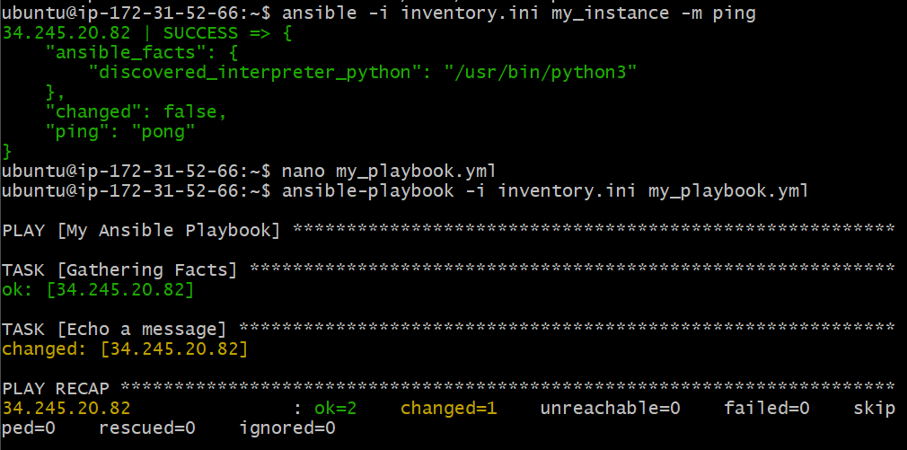
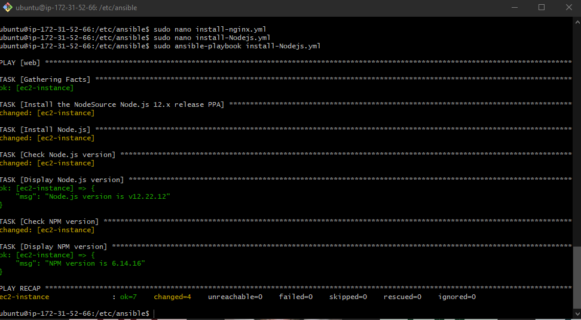

## Setting up Ansible

#### Install Ansible

1. **`sudo apt install software-properties-common`**: Installs the `software-properties-common` package, which provides scripts for managing software repositories. This is a prerequisite for adding the Ansible repository.

2. **`sudo apt-add-repository ppa:ansible/ansible`**: Adds the Ansible Personal Package Archive (PPA) to your list of sources. This ensures that you can install Ansible directly from this source.

3. **`sudo apt update -y`**: Updates the local package cache to make sure you have the latest list of packages from all repositories, including the recently added Ansible PPA.

4. **`sudo apt install ansible -y`**: Installs the Ansible software package.

5. **`ansible --version`**: Checks the installed version of Ansible.

#### Looking Inside File Structure

1. **`cd /etc/ansible/`**: Navigates to the `/etc/ansible/` directory, where Ansible's global configuration and inventory files are typically located.

2. **`sudo apt install tree`**: Installs the `tree` utility, which is used for directory visualization.

3. **`tree`**: Runs the `tree` command to display a tree view of the directory structure. In this case, you would be seeing the structure of the `/etc/ansible/` directory.

#### SSH

1. **`scp -i "~/.ssh/tech254.pem" ~/.ssh/tech254.pem ubuntu@ec2-34-250-136-251.eu-west-1.compute.amazonaws.com:~/.ssh`**: Copies your local `.pem` file (`tech254.pem`) to a remote machine via SSH. The `-i` option specifies the key to use for the operation.

   - Source: `~/.ssh/tech254.pem`
   - Destination: `ubuntu@ec2-34-250-136-251.eu-west-1.compute.amazonaws.com:~/.ssh`
   
2. **`cd ~/.ssh and ls to check if it's there`**: After SSHing into the remote machine, you'll navigate to the `~/.ssh/` directory and list the files (`ls`) to verify that `tech254.pem` has been successfully transferred.


#### Controller

1. **`nano inventory.ini`**: Opens the `inventory.ini` file in the Nano text editor. If the file doesn't exist, Nano will create it. This file will hold information about the machines that Ansible will manage.

   - `inventory.ini` file contents:

    ```ini
    [my_instance]
    34.245.20.82 ansible_ssh_private_key_file=~/.ssh/tech254.pem ansible_ssh_user=ubuntu
    ```
    - `[my_instance]`: This is a group name for the hosts you want to manage.
    - `34.245.20.82`: This is the IP address of the machine you want to manage.
    - `ansible_ssh_private_key_file`: Specifies the SSH key to be used for the connection.
    - `ansible_ssh_user`: Specifies the user to connect as.

2. **`chmod 400 ~/.ssh/tech254.pem`**: Changes the permissions of the `tech254.pem` file to be read-only for the owner. This is often a requirement for SSH keys to ensure they are kept secure.

3. **`ansible -i inventory.ini my_instance -m ping`**: Executes a basic connectivity test to the servers listed under the `[my_instance]` group in the `inventory.ini` file.
  
    - `-i inventory.ini`: Specifies the inventory file.
    - `my_instance`: The group of hosts you want to ping.
    - `-m ping`: Uses the `ping` module to test connectivity.

4. **`nano my_playbook.yml`**: Opens the `my_playbook.yml` file. Enter the task you want it to complete, for example:

```yaml
---
- name: My Ansible Playbook
  hosts: my_instance
  tasks:
    - name: Echo a message
      command: echo "Hello, Ansible!"

```


5. **`ansible-playbook -i inventory.ini my_playbook.yml`**: Executes an Ansible playbook against a group of hosts specified in `inventory.ini`.

   - `-i inventory.ini`: Specifies the inventory file that contains information about the hosts you want to manage.
   - `my_playbook.yml`: Specifies the YAML file containing all the tasks you want Ansible to execute.


We should see the following:



## Setting up controller to install nginx and node js.

### Setting permissions

Below is an alternate way to set up the controller, as taught in class.

We need to give the controller the correct pem file so it can connect to the ec2 instance.

Navigate to /etc/ansible

Use `sudo nano hosts` and add a `[web]` header in this file and paste in the public IP of the APP

`ec2-instance ansible_host=52.214.15.174 ansible_user=ubuntu ansible_ssh_private_key_file=/home/ubuntu/.ssh/tech254.pem`

`sudo ansible web -m ping` - ping an endpoint to test the connection is working correctly.


### Install nginx

Create a file called install nginx and paste in the following

`sudo nano install-nginx.yml`


```yaml
# create a playbook to provision nginx web server in web-node
---
# where do you want to install or run this playbook
- hosts: web

# find the facts
  gather_facts: yes
# provide admin access to this playbook - use sudo
  become: true
# provide the actual instructions - install nginx
  tasks:
  - name: provision/install/configure Nginx
    apt: pkg=nginx state=present
# ensure nginx is running/enable
```
Run it using `sudo ansible-playbook install-nginx.yml`

### Install node js

Create a file called install nodejs and paste in the following

`sudo nano install-nodejs.yml`


``` yaml
---
# where do you want to install or run this playbook
- hosts: web

# find the facts
  gather_facts: yes

# provide admin access to this playbook - use sudo
  become: true

# provide the actual instructions - install NodeJS
  tasks:
  - name: Install the NodeSource Node.js 12.x release PPA
    shell: "curl -sL https://deb.nodesource.com/setup_12.x | bash -"

  - name: Install Node.js
    apt: pkg=nodejs state=present

  - name: Check Node.js version
    shell: "node -v"
    register: node_version

  - name: Display Node.js version
    debug:
      msg: "Node.js version is {{ node_version.stdout }}"

  - name: Check NPM version
    shell: "npm -v"
    register: npm_version

  - name: Display NPM version
    debug:
      msg: "NPM version is {{ npm_version.stdout }}"


```

Run it using `sudo ansible-playbook install-nodejs.yml`

After the tasks have finished, we will see that nodejs has been successfully installed as we have set up a task to return the version, and a version has been returned.




## Setting up mongodb

`sudo nano mongo-playbook.yml`
Same as before paste the following in, making sure to use hosts db. This will install and verify that mongodb is running on our db instance:

```yaml
# set up mongodb

---

# agent node name/ip

- hosts: db


# gather facts

  gather_facts: yes

# provide admin access

  become: true

# provide instructions

  tasks:
  - name: set up mongodb in db ec2
    apt: pkg=mongodb state=present

# Ensure db is running
sudo ansible db -a "sudo systemctl status mongodb
```

In order to allow connections from anywhere, we need to change the bindip of the mongodb configuration file to 0.0.0.0. this 

```yaml
- name: Configure MongoDB to Accept Requests
  hosts: db
  become: yes
  tasks:
    - name: Set bind IP to accept requests from all IPs
      lineinfile:
        path: /etc/mongodb.conf
        regexp: '^bind_ip = 127\.0\.0\.1'
        line: 'bind_ip: 0.0.0.0'

    - name: Restart MongoDB Service
      service:
        name: mongodb
        state: restarted

    - name: Enable MongoDB Service on Boot
      service:
        name: mongodb
        enabled: yes
```


To  set up the environment variable, we can use the following. This will connect to the instance and create an env variable in .bashrc

```yaml
---
- hosts: web
  tasks:
    - name: Add environment variable to ~/.bashrc
      lineinfile:
        path: /home/ubuntu/.bashrc
        line: 'export DB_HOST2=mongodb://34.254.204.30:27017/posts'

```
We can use `source ~/.bashrc` (while in the app instance) to load the environment variable

