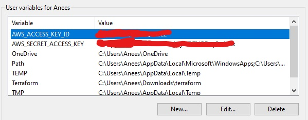

# Orchestration with Terraform

## What

Terraform is an open-source infrastructure as code (IaC) tool that allows you to build, change, and version infrastructure efficiently. Orchestration with Terraform involves describing your infrastructure as code, which enables automation, version control, and reusability.

## Where

Terraform can be used across multiple environments:

- **Cloud Providers**: AWS, Azure, Google Cloud, etc.
- **On-Premises**: VMWare, OpenStack
- **Hybrid Environments**: A mix of cloud and on-premises resources
- **Other Services**: Database providers, DNS providers, monitoring services, and more

## Why

1. **Automation**: Manually setting up infrastructure can be error-prone and time-consuming. Terraform automates this process.
2. **Version Control**: You can track changes, rollback, and view the history of your infrastructure.
3. **Modularity and Reusability**: Write once, use everywhere. Modules in Terraform allow you to reuse configurations.
4. **Multi-Provider Support**: Ability to manage diverse resources from different providers cohesively.
5. **Cost Savings**: By automating the creation and destruction of resources, you can save on operational costs.

## When

- **New Projects**: Start with a codified infrastructure from day one.
- **Migration**: When moving to a new provider or just reorganizing your current setup.
- **Scale**: As your application grows, Terraform makes it easier to manage more complex infrastructure needs.
- **CI/CD Pipeline Integration**: For continuous delivery and continuous deployment.

## How

### Installation

Download the appropriate package from the [official Terraform website](https://www.terraform.io/downloads.html) and install it.

### Initialization

Create a new directory and initialize Terraform:

```bash
mkdir my_terraform_project
cd my_terraform_project
terraform init
```

# Terraform AWS Setup Notes

## Initial Setup

### Setting Up Access Keys

To securely connect to AWS, you'll need to set up AWS access keys.

 Open the Windows search bar and search for "Environment Variables". Click on the first option that appears, usually named "Edit the system environment variables".

 In the Environment Variables dialog, you'll see two sections for User variables and System variables. Under the User variables section, click on the "New" button and enter the keys with the same variable name as below





### Configure AWS Provider

The first thing to do in the Terraform configuration file `main.tf` is to specify the AWS provider.

```powershell
# who is the provider
provider "aws" {
  # location of aws
  region = "eu-west-1"
}
```

In this snippet, the AWS provider is specified, and the AWS region is set to `eu-west-1`.

### Initialize Terraform 

Run `terraform init` to initialize Terraform in the project directory. This command installs the AWS provider.

```bash
terraform init
```

This downloads the required dependencies.

---

### Setting Up AWS EC2 Instance

### Resource Configuration

To create an AWS EC2 instance, add the following snippet to the `main.tf` file:

```powershell
# create a service/resource on the cloud - ec2 on aws
resource "aws_instance" "anees-iac-tech254" {
  ami           = "ami-0943382e114f188e8"
  instance_type = "t2.micro"
  tags = {
    Name = "anees-iac-tf-tech254"
  }
}
```

Here, the resource is an AWS instance with the ID `anees-iac-tech254`. The Amazon Machine Image (AMI) used is `ami-0943382e114f188e8`, and the instance type is `t2.micro`.

### Preview Changes

Before applying the changes, run `terraform plan` to preview them.


`terraform plan`


### Apply Changes

To apply the configuration and create the EC2 instance, run:

`terraform apply`

### Destroy Infrastructure

To destroy the created resources, run:

`terraform destroy`

This will remove all resources that have been created.


